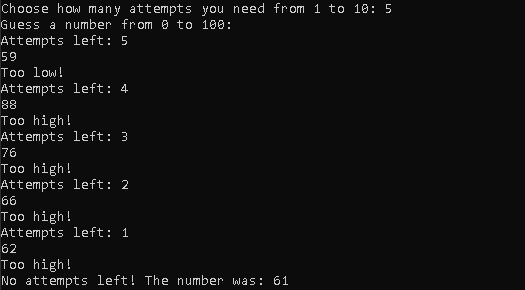

# Guess-Number-Game
A command line based program of the "Guess the number" game

## Dependencies
1. Git - https://git-scm.com/downloads
2. Python - https://www.python.org/downloads/

## Installation
1. Choose a folder where to download it
2. Open Git Bash in it
3. Type or copy & paste: git clone https://github.com/iivanov444/Guess-Number-Game

## Usage
Open Terminal(Windows: PowerShell, Linux: Bash, MacOS: Terminal)
and type or copy & paste: python main_program.py

## Examples
Run the program in the Terminal, choose how many tries you need and start trying to guess the number

## License
MIT License
